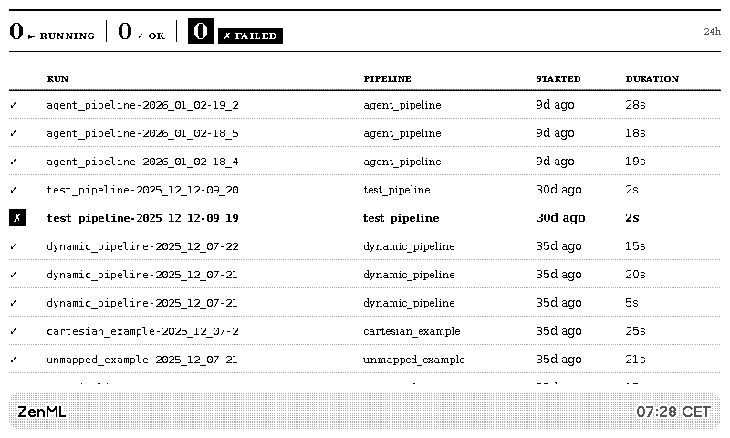

# ZenML → TRMNL Private Plugin

Display ZenML pipeline status on a [TRMNL](https://usetrmnl.com) e-ink display, updated automatically via GitHub Actions.



## Features

- **Recent Runs View**: Shows the last 12 pipeline runs with status, duration, and timing
- **Pipelines Overview**: Lists all pipelines with their latest run status
- **Running Only View**: Focus on currently executing pipelines (auto-switches to recent runs when idle)
- **24-hour Statistics**: Running, completed, failed, and cached counts
- **Configurable Timezone**: Display times in your local timezone
- **Dry Run Mode**: Test locally before pushing to your device

## Quick Start

### 1. Install uv (if not already installed)

```bash
curl -LsSf https://astral.sh/uv/install.sh | sh
```

### 2. Clone and set up the project

```bash
git clone https://github.com/YOUR_USERNAME/trmnl-zenml.git
cd trmnl-zenml
uv sync
```

### 3. Create a ZenML Service Account

```bash
zenml service-account create trmnl-dashboard
# Save the API key that's printed!
```

### 4. Test locally with dry-run

```bash
export ZENML_SERVER_URL="https://your-zenml-server.example.com"
export ZENML_API_KEY="your-api-key"
export ZENML_PROJECT="default"  # Or your project name
export DISPLAY_TIMEZONE="Europe/Berlin"  # Optional

uv run python zenml_trmnl.py --dry-run
```

### 5. Set up TRMNL Private Plugin

1. Go to your [TRMNL dashboard](https://usetrmnl.com)
2. Create a new **Private Plugin**
3. Set the data source to **Webhook**
4. Copy the Webhook URL
5. Paste the [markup template](#trmnl-markup-templates) into the editor
6. Save and add to your playlist

### 6. Push to your device

```bash
export TRMNL_WEBHOOK_URL="https://usetrmnl.com/api/custom_plugins/your-uuid"
uv run python zenml_trmnl.py
```

## GitHub Actions Setup (Automated Updates)

The included workflow updates your TRMNL display every 5 minutes.

### Required Secrets

Go to **Settings → Secrets and variables → Actions** and add:

| Secret | Description |
|--------|-------------|
| `ZENML_SERVER_URL` | Your ZenML server URL |
| `ZENML_API_KEY` | ZenML service account API key |
| `ZENML_PROJECT` | ZenML project name (e.g., `default`) |
| `TRMNL_WEBHOOK_URL` | TRMNL webhook URL from your plugin |

### Optional Variables

Go to **Settings → Secrets and variables → Actions → Variables** and add:

| Variable | Default | Description |
|----------|---------|-------------|
| `DISPLAY_TIMEZONE` | `UTC` | Timezone for timestamps (e.g., `Europe/Berlin`) |

### Manual Trigger

You can manually trigger the workflow from the Actions tab with options:
- **View mode**: Choose between `recent_runs`, `pipelines_overview`, or `running_only`
- **Dry run**: Print payload without sending to TRMNL

## Environment Variables Reference

| Variable | Required | Default | Description |
|----------|----------|---------|-------------|
| `ZENML_SERVER_URL` | Yes | - | ZenML server URL |
| `ZENML_API_KEY` | Yes | - | ZenML service account API key |
| `ZENML_PROJECT` | No | `default` | ZenML project name or ID |
| `TRMNL_WEBHOOK_URL` | Yes* | - | TRMNL webhook URL (*not needed for `--dry-run`) |
| `VIEW_MODE` | No | `recent_runs` | View mode: `recent_runs`, `pipelines_overview`, `running_only` |
| `DISPLAY_TIMEZONE` | No | `UTC` | Timezone for display (e.g., `Europe/Berlin`, `America/New_York`) |

## TRMNL Markup Templates

Copy these templates into your TRMNL Private Plugin's markup editor.

> **Design Note**: These templates are optimized for e-ink displays using a "dashboard newspaper" aesthetic - high contrast, clear typography hierarchy, and scannable information density.

### Recent Runs View (Full Screen)

```html
<div class="view view--full">
  <div class="layout layout--padding-sm">
    <div class="columns">
      <div class="column">
        <!-- Stats Header Bar -->
        <div class="stats-bar">
          <div class="stats-item">
            <span class="stats-value">{{ running_count }}</span>
            <span class="stats-label">►&nbsp;RUNNING</span>
          </div>
          <div class="stats-divider"></div>
          <div class="stats-item">
            <span class="stats-value">{{ completed_count }}</span>
            <span class="stats-label">✓&nbsp;OK</span>
          </div>
          <div class="stats-divider"></div>
          <div class="stats-item stats-item--alert">
            <span class="stats-value">{{ failed_count }}</span>
            <span class="stats-label">✗&nbsp;FAILED</span>
          </div>
          <div class="stats-period">{{ stats_period }}</div>
        </div>

        <!-- Pipeline Runs Table -->
        <table class="table table--small runs-table" data-table-limit="true">
          <thead>
            <tr>
              <th class="col-status"></th>
              <th class="col-run">Run</th>
              <th class="col-pipeline">Pipeline</th>
              <th class="col-time">Started</th>
              <th class="col-duration">Duration</th>
            </tr>
          </thead>
          <tbody>
            
            <tr class="row--failedrow--running">
              <td class="col-status">
                <span class="status-icon status-icon--failedstatus-icon--running">{{ run.status_icon }}</span>
              </td>
              <td class="col-run">
                <span class="run-name" data-clamp="1">{{ run.name }}</span>
              </td>
              <td class="col-pipeline">
                <span class="pipeline-name" data-clamp="1">{{ run.pipeline }}</span>
              </td>
              <td class="col-time">{{ run.started }}</td>
              <td class="col-duration">{{ run.duration }}</td>
            </tr>
            
          </tbody>
        </table>
      </div>
    </div>
  </div>

  <div class="title_bar">
    
    <span class="title">ZenML</span>
    <span class="instance">{{ updated_at }}</span>
  </div>
</div>

<style>
  /* Stats Header Bar - Newspaper-style metrics */
  .stats-bar {
    display: flex;
    align-items: center;
    padding: 8px 0;
    margin-bottom: 8px;
    border-top: 2px solid #000;
    border-bottom: 1px solid #000;
  }
  .stats-item {
    display: flex;
    align-items: baseline;
    gap: 4px;
    padding: 0 12px;
  }
  .stats-item:first-child { padding-left: 0; }
  .stats-value {
    font-size: 24px;
    font-weight: 700;
    line-height: 1;
  }
  .stats-label {
    font-size: 10px;
    font-weight: 600;
    letter-spacing: 0.5px;
    text-transform: uppercase;
  }
  .stats-item--alert .stats-value,
  .stats-item--alert .stats-label {
    background: #000;
    color: #fff;
    padding: 2px 6px;
  }
  .stats-divider {
    width: 1px;
    height: 24px;
    background: #000;
  }
  .stats-period {
    margin-left: auto;
    font-size: 10px;
    color: #666;
    font-style: italic;
  }

  /* Table Styling */
  .runs-table { width: 100%; }
  .runs-table th {
    font-size: 9px;
    font-weight: 700;
    text-transform: uppercase;
    letter-spacing: 0.5px;
    border-bottom: 1px solid #000;
    padding: 4px 8px 4px 0;
    text-align: left;
  }
  .runs-table td {
    padding: 6px 8px 6px 0;
    font-size: 12px;
    border-bottom: 1px solid #ddd;
    vertical-align: middle;
  }
  .col-status { width: 24px; text-align: center; padding-right: 4px !important; }
  .col-run { width: 35%; }
  .col-pipeline { width: 25%; }
  .col-time { width: 15%; }
  .col-duration { width: 15%; text-align: right; }

  /* Status Icons */
  .status-icon {
    display: inline-block;
    width: 18px;
    height: 18px;
    line-height: 18px;
    text-align: center;
    font-size: 12px;
  }
  .status-icon--failed {
    background: #000;
    color: #fff;
    font-weight: 700;
  }
  .status-icon--running {
    border: 2px solid #000;
    border-radius: 50%;
    width: 14px;
    height: 14px;
    line-height: 12px;
    font-size: 10px;
  }

  /* Row States */
  .row--failed {
    background: #e8e8e8;
  }
  .row--failed td {
    font-weight: 600;
  }
  .row--running {
    background: #f5f5f5;
  }

  /* Text Styling */
  .run-name {
    font-weight: 500;
    font-family: monospace;
    font-size: 11px;
  }
  .pipeline-name {
    color: #444;
    font-size: 11px;
  }
</style>
```

### Pipelines Overview (Half Vertical)

```html
<div class="view view--half_vertical">
  <div class="layout">
    <div class="columns">
      <div class="column">
        <span class="title">{{ title }}</span>

        <table class="table table--xsmall" data-table-limit="true">
          <thead>
            <tr>
              <th><span class="title title--small"></span></th>
              <th><span class="title title--small">Pipeline</span></th>
              <th><span class="title title--small">Status</span></th>
            </tr>
          </thead>
          <tbody>
            
            <tr class="row--emphasis">
              <td><span class="label label--bold">{{ pipeline.status_icon }}</span></td>
              <td><span class="label label--small" data-clamp="1">{{ pipeline.name }}</span></td>
              <td><span class="label label--small">{{ pipeline.latest_status }}</span></td>
            </tr>
            
          </tbody>
        </table>

        <span class="label label--small mt-2">{{ updated_at }}</span>
      </div>
    </div>
  </div>

  <div class="title_bar">
    <span class="title">ZenML Pipelines</span>
  </div>
</div>

<style>
  .row--emphasis { background-color: #e0e0e0; }
  .label--bold { font-weight: 700; }
</style>
```

### Running Only (Quadrant)

```html
<div class="view view--quadrant">
  <div class="layout">
    <div class="columns">
      <div class="column">
        <div class="flex items-center gap-2 mb-2">
          <span class="value value--large">{{ running_count }}</span>
          <span class="label">Running</span>
        </div>

        
        <div class="flex items-center gap-1 mb-1">
          <span class="label label--small">►</span>
          <span class="label label--small" data-clamp="1">{{ run.pipeline }}</span>
          <span class="label label--small">{{ run.duration }}</span>
        </div>
        

        
        <span class="label label--small">No pipelines running</span>
        
      </div>
    </div>
  </div>

  <div class="title_bar">
    <span class="title">ZenML</span>
  </div>
</div>
```

## Status Icons

| Status | Icon |
|--------|------|
| Completed | ✓ |
| Running | ► |
| Failed | ✗ |
| Cached | ≡ |
| Initializing/Provisioning | ○ |
| Stopped | ■ |
| Stopping | □ |
| Retried | ↻ |

## License

MIT
